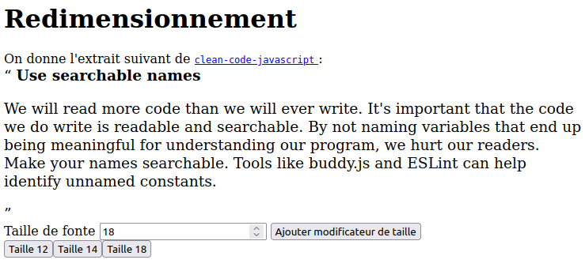

# 27_0198 Développement Web - TP 1

- [27_0198 Développement Web - TP 1](#27_0198-développement-web---tp-1)
  - [Les décorateurs](#les-décorateurs)
    - [Le décorateur `chrono`](#le-décorateur-chrono)
    - [D'autres décorateurs](#dautres-décorateurs)
    - [Parallèle en Python](#parallèle-en-python)
  - [L'API fonctionnelle de la classe `Array`](#lapi-fonctionnelle-de-la-classe-array)
    - [Exemple](#exemple)
    - [Tutoriel](#tutoriel)
    - [Exercice](#exercice)
  - [Décorateur mystère](#décorateur-mystère)
  - [Modificateur de taille](#modificateur-de-taille)

Ce TP a pour but de vous familiariser à la programmation fonctionnelle en écrivant quelques _décorateurs_.
Une deuxième partie est consacrée à l'API fonctionnelle de la classe `Array`.

**Pour vendredi 22/07/22 en séance** :

- avoir fait `once`, `maybe` et `memoize`;
- mettre à jour le fichier `src/decorator.mjs` de la GitHub classroom <https://classroom.github.com/a/Pcj8zdJc>
- ajouter la réponse au 3ème exercice _modificateur de taille_

## Les décorateurs

Un décorateur est une fonction qui "modifie le comportement d'une autre fonction”.
Plus précisément, c'est une fonction _deco_ qui prend une fonction _fct_ en argument, telle que _deco(fct)_ est la fonction _fct_ dont le comportement est modifié.

Fichiers de départ [tp1.html](tp1.html) et [tp1.js](tp1.js).

### Le décorateur `chrono`

On donner l'exemple suivant, d'un décorateur qui affiche le temps d'exécution

```javascript
function chrono(fct) {
  // c.f. https://javascript.info/rest-parameters-spread
  return function (...args) {
    const start = Date.now();
    const res = fct(...args);
    const end = Date.now();
    console.info(`${fct.name}(...) executed in ${end - start}ms`);
    return res;
  };
}

function f(x, y, z) {
  return 2 * x - y + 3 * z;
}

function g(arr) {
  return arr.reduce((a, b) => a + b, 0);
}

console.log(f(1, 2, 3));
const _f = chrono(f);
console.log(_f(1, 2, 3));
setTimeout(() => _f(1, 3, 3), 1000);
```

- Tester le décorateur `chrono` sur la fonction `g` de sorte à ce que le temps passé soit substantiel.
- Si on déclenche `f` au bout de 1 seconde dans un `setTimeout(() => f(1, 2, 3), 1000)`, quel sera le temps affiché par `chrono` ? Le prévoir avant de tester.

### D'autres décorateurs

Ecrire les décorateurs suivants. On ne demande **pas** de gérer les exceptions.

- `once(fct)` : au premier appel, renvoie le résultat renvoyé par `fct` et renvoie ce même résultat, quels que soient les arguments passés en paramètres, pour les appels suivants (sans rappeller `fct`).
  - Commencer avec `fct` unaire, puis avec les [Rest parameters and spread syntax](https://javascript.info/rest-parameters-spread), passez au cas général.
- `maybe(fct, def)` : appelle `fct` et si `fct` renvoie `undefined`, alors renvoie `def` à la place, une valeur par défaut.
  - Commencer avec `fct` unaire, puis avec les [Rest parameters and spread syntax](https://javascript.info/rest-parameters-spread), passez au cas général.
  - en utilisant habilement les _closure_ et les _fat arrows_, faire en sorte que `fct` ne soit bien appellée **qu'une seule fois**.
- `memoize(fct)` : si `fct` (supposée unaire) a déjà été appelée avec le même argument, renvoie directement [^1] la valeur retournée précédemment par `fct` pour cet argument.
  - Ce décorateur ressemble assez à `once(fct)`, avec un dictionnaire pour enregistrer plusieurs valeurs au lieu d'une seule. Utiliser [`Map`](https://developer.mozilla.org/en-US/docs/Web/JavaScript/Reference/Global_Objects/Map)
- `chain(n)(fct)` enchaine la fonction `fct` (supposée unaire) _n_ fois, c'est-à-dire renvoie la fonction _x ↦ fct(fct(...(fct(x))...))_ où _fct_ est appellée _n_ fois. Si l'entier _n_ est nul alors la fonction identité est renvoyée _x ↦ x_. On donnera une version _itérative_ et une version _récursive_ de `chain(n)(fct)`.

Voir [cet exemple](rest_spread.js) pour l'utilisation des _rest parameters_ et de la _spread syntax_.

[^1]: _i.e._ sans rappeler `fct`

### Parallèle en Python

**Pour aller plus loin** ou si vous faites du Python régulièrement.

Le terme de _décorateur_ est issu de la terminologie Python, où ses fonctions bénéficient même d'une syntaxe _ad hoc_, voir par exemple, [le module `functools`](https://docs.python.org/3/library/functools.html).

```python
from time import time
from functools import wraps

def chrono(fct):
    """From https://stackoverflow.com/questions/51503672/decorator-for-timeit-timeit-method"""

    @wraps(fct)
    def inner(*args, **kwargs):
        start = int(round(time() * 1_000))
        try:
            return fct(*args, **kwargs)
        finally:
            end_ = int(round(time() * 1_000)) - start
            print(f"{fct.__name__}() execution time: {end_ if end_ > 0 else 0} ms")

    return inner

@chrono
def somme(l):
    return sum(l)

print(somme(list(range(int(1e7)))))
```

## L'API fonctionnelle de la classe `Array`

La classe `Array` dispose des méthodes suivantes qui prennent toutes une fonction en paramètre :

- <https://developer.mozilla.org/en-US/docs/Web/JavaScript/Reference/Global_Objects/Array/find>
- <https://developer.mozilla.org/en-US/docs/Web/JavaScript/Reference/Global_Objects/Array/some>
- <https://developer.mozilla.org/en-US/docs/Web/JavaScript/Reference/Global_Objects/Array/every>
- <https://developer.mozilla.org/en-US/docs/Web/JavaScript/Reference/Global_Objects/Array/filter>
- <https://developer.mozilla.org/en-US/docs/Web/JavaScript/Reference/Global_Objects/Array/map>
- <https://developer.mozilla.org/en-US/docs/Web/JavaScript/Reference/Global_Objects/Array/reduce>

### Exemple

Voir le fichier [demo.js](demo.js) pour comparer les approches impératives _classiques_ (avec boucle for explicite et affectation) et _fonctionnelles_ sur un calcul simple.

### Tutoriel

Pour chacune des variables définies dans le programme suivant, essayer de prédire sa valeur puis vérifier (dans la console JavaScript ou avec Node.js).

```javascript
const tab = [1, 2, 3, 4, 5, 6, 7, 8, 9];

const t1 = tab.filter((n) => n > 3);

const t2 = tab.map((n) => n + 10);

const v1 = tab.some((n) => n !== 3 && n % 3 === 0);

const v2 = tab.some((n) => n !== 5 && n % 5 === 0);

const t3 = tab.filter((n) => n % 2 === 0).map((n) => 2 * n);

const t4 = tab.map((n) => 2 * n).filter((n) => n % 2 === 0);

// ici on utilise un if expression ou "if ternaire"
// https://developer.mozilla.org/en-US/docs/Web/JavaScript/Reference/Operators/Conditional_Operator
const v3 = tab.reduce((acc, n) => acc + (n % 2 === 0 ? n * n : 0), 0);

const v4 = tab
  .filter((n) => n % 2 === 0)
  .map((n) => n * n)
  .reduce((acc, n2) => acc + n2, 0);

const v5 = tab.filter((n) => n <= 4).reduce((acc, n) => acc * n, 1);

const v6 = tab
  .filter((n) => n % 3 === 0)
  .map((n) => ({ v: n, c: 1 }))
  .reduce((acc, o) => ({ s: acc.s + o.v, c: acc.c + o.c }), { s: 0, c: 0 });

const v7 = ((o) => o.s / o.c)(v6);
```

### Exercice

On considère maintenant un tableau d'objets comme suit :

```javascript
const arr = [
  { name: "Alice", age: 40, sal: 250000 },
  { name: "Bob", age: 17, sal: -1 },
  { name: "Charlie", age: 30, sal: 180000 },
  { name: "Denise", age: 12, sal: -1 },
];
```

En utilisant l'API `Array`, sans utiliser de boucle `for` explicite et avec uniquement des variables `const`, écrire les fonctions suivantes qui prennent toutes en paramètre un tableau d'objets comme `arr` et :

- retourne `true` si et seulement tous les majeurs ont un salaire supérieur à 150000
- retourne un tableau de chaines de la forme `nom: age` ne contenant que les personnes majeures.
- calcule le salaire moyen des personnes majeures.
  - une solution consiste ici à écrire un `reduce` qui va compter la somme des salaires _et en parallèle_ le nombre de majeurs, l'exercice précédent vous a donné une bonne partie de la réponse.

Sur l'exemple, on devrait obtenir :

```javascript
console.log(exo1(arr));
// true
console.log(exo2(arr));
// [ 'Alice: 40', 'Charlie: 30' ]
console.log(exo3(arr));
// 215000
```

## Décorateur mystère

On considère le décorateur `m` suivant :

```javascript
function m(f) {
  function w(...a) {
    w.x.push(a);
    return f(...a);
  }

  w.x = [];
  return w;
}

const adder_decorated = m((a, b) => a + b);

console.log(adder_decorated(2, 3));
console.log(adder_decorated(3, 4));
```

- Expliquez ce que fait ce décorateur.
- Renommez les identifiants de variables, fonctions et propriétés `m`, `f`, `w`, `a` et `x` pour rendre le code clair.
- Donnez un exemple d'utilisation de ce décorateur pour du test.

## Modificateur de taille

On souhaite modifier [tp1.html](tp1.html) et [tp1.js](tp1.js) pour créer des boutons qui modifieront la taille d'une citation (élément HTML `<q>`).

Il faut que quand on clique sur le bouton _Ajouter modificateur de taille_ et que le champ de saisi vaut $n$, un nouveau bouton soit ajouté à la page, et que quand on clique à son tour dessus, celui-ci mettra la citation à la taille $n$.

Ci-dessous, un exemple ou trois bouttons ont été ajoutés, pour passer le texte aux tailles 12, 14 ou 18. Là, on a cliqué sur le bouton _Taille 14_ et le texte a grossi.



