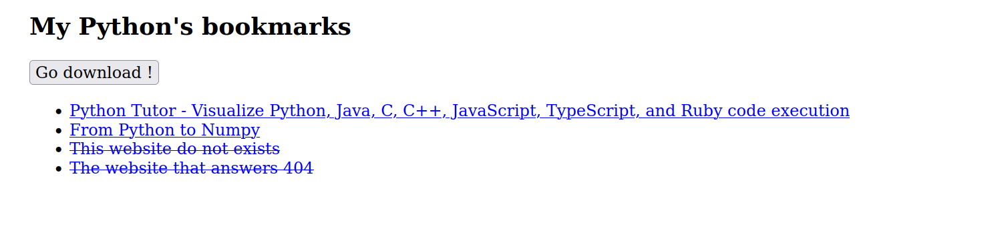

# Introduction à la programmation asynchrone avec `fetch`

Dans ce TP on va utiliser l'API `fetch` du navigateur <https://developer.mozilla.org/en-US/docs/Web/API/Fetch_API>.
Cette API utilise les promesses et proposes différents objets standards comme [`Headers`](https://developer.mozilla.org/en-US/docs/Web/API/Headers), [`Request`](https://developer.mozilla.org/en-US/docs/Web/API/Request) et [`Response`](https://developer.mozilla.org/en-US/docs/Web/API/Response), que l'on retrouvera aussi côté serveur avec par exemple le module [`node-fetch`](https://www.npmjs.com/package/node-fetch).

**Important** pour ce TP, vous _devez_ avoir un serveur Web, aussi simple soit-il. Vous pouvez utiliser soit :

- [l'extension Live Server](https://marketplace.visualstudio.com/items?itemName=ritwickdey.LiveServer) pour VSCode
- ouvrir un serveur Python avec [le module `http.server`](https://docs.python.org/3/library/http.server.html), comme avec la ligne de commande suivante `python -m http.server --bind 127.0.0.1 5000` (sur le port 5000, en `localhost` seulement).

On donne une page de départ contenant un formulaire avec trois champs [demo-formulaire.html](demo-formulaire.html) ainsi que les fichiers [demo-formulaire.js](demo-formulaire.js) et [demo-formulaire.css](demo-formulaire.css)

## Exercice : chargement dynamique de contenus avec `fetch`

On va utiliser l'API `fetch` du navigateur pour cette fois remplir dynamiquement le contenu d'une page dont on aura qu'un squelette.
Quand on clique sur le bouton _Go download!_, effectuer le traitement suivant :

- télécharger [`data/all-bookmarks-status.json`](data/all-bookmarks-status.json) avec `fetch`
- _parser_ le contenu du fichier en JSON avec [`response.json()`](https://developer.mozilla.org/en-US/docs/Web/API/Response/json)
- pour chacun des liens contenus, ajouter un item de la forme `<li><a href="url_du_lien">titre du lien</a>/<li>` à la liste
  - si le lien est mort (`status` différent de 200 dans le contenu JSON), alors affichez quand même le lien mais avec un style `text-decoration: line-through` pour qu'il soit barré.
  - quand on clique sur un lien, demandez une confirmation avant de quitter la page. Pour cela, comme dans l'exercice 2, intercepter l'événement par défaut, voir [Browser default actions](https://javascript.info/default-browser-action).

Le rendu final, pour ici une liste de quatre liens dont deux morts, pourrait ressembler à celui-ci:



Faites l'exercice de deux façons :

- une première fois directement avec les `Promise`;
- une deuxième fois en utisant `await`, sans promesses explicites.

## Exercice : remplacement de soumission de formulaire par `fetch`

Le but de cet exercice est de gérer ce formulaire **côté client uniquement**, c'est-à-dire qu'on ne va **pas** envoyer une requête HTTP au serveur quand on clique sur le bouton _Envoyer_ : on va à la place **remplacer** le _handler_ par défaut des formulaires par un nouveau qui va faire une requête `POST` à un serveur tiers et afficher sa réponse HTTP dans la page, _sans passer par le serveur qui a servie la page HTML_.

Dans le fichier [demo-formulaire.js](demo-formulaire.js), un _handler_ est déjà associé au [HTMLFormElement](https://developer.mozilla.org/en-US/docs/Web/API/HTMLFormElement) de la page.

On veut récupérer les contenus saisis par l'utilisateur dans le formulaire.
L'API DOM propose une classe [`FormData`](https://developer.mozilla.org/en-US/docs/Web/API/FormData/FormData) pour faciliter la gestion des formulaire avec l'API `fetch`.
C'est ce que fait la fonction fournie `formDataToJSON`.

- Avec une requêtes `fetch` de type `POST` comme ci-après, envoyer le contenu du formulaire à `https://httpbin.org/anything`
- Récupérer la réponse HTTP envoyée par le serveur et vérifiez que le contenu est bien le même que celui envoyé en l'affichant avec un `alert`.
- Tester avec la route `https://httpbin.org/status/501` du même site. Traiter l'erreur.

```javascript
fetch("https://httpbin.org/post", {
  method: "POST",
  headers: {
    "Content-Type": "application/json",
  },
  body: JSON.stringify(data),
});
```
