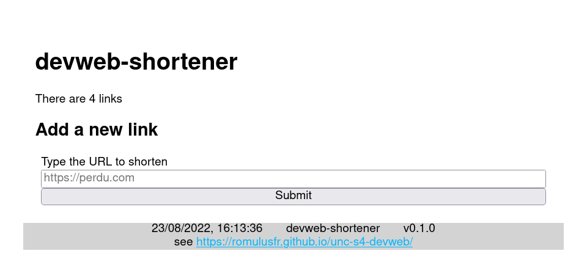
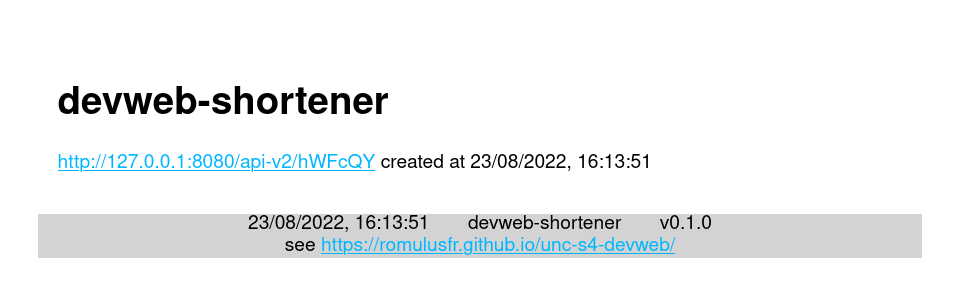
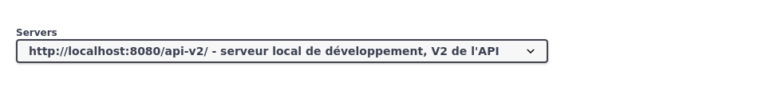
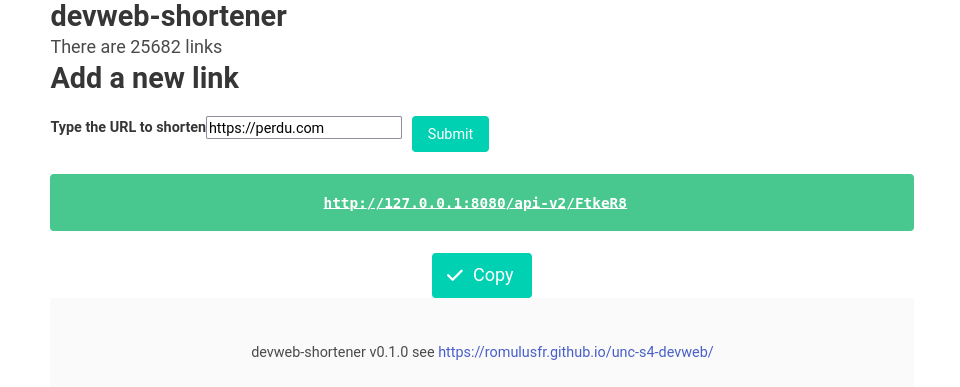
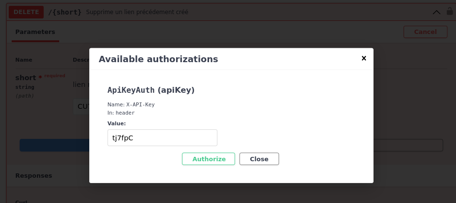

# Projet : réducteur d'URL en Node.js/Express

Ce projet consiste à réaliser un service simple de [réduction d'URL](https://en.wikipedia.org/wiki/URL_shortening) comme <https://bit.ly/> ou <https://tinyurl.com/>
Il s'agit d'abord de la réalisation d'une API serveur REST puis d'un client :

- **Partie 1** : prendre en main le projet, _tag_ `reponses`.
- **Partie 2** : compléter les fonctionnalités manquantes de l'API v1, _tag_ `api-v1`.
- **Partie 3** : ajouter un HTML côté serveur et négocier les contenus, _tag_ `api-v2`.
- **Partie 4** : faire un client AJAX qui utilise l'API v2, _tag_ `client-ajax`.
- **Partie 5** : fonctionnalité de suppression avec authentification, _tag_ `api-v2-delete`.

Un projet de départ d'application est disponible dans la Github Classroom à l'addresse <https://classroom.github.com/a/N63pw_jM>.

## Introduction

Le service à réaliser permet de transformer une URL longue, comme <https://nodejs.org/api/http.html#event-connect_1> en une URL courte <http://localhost/WmFJQp> qui redirige vers l'URL d'origine quand on se rend dessus.
Le service propose les routes suivantes, qui répondent des documents JSON (en-tête `Content-Type: application/json`) :

- `GET /` renvoie le nombre de liens déjà créés;
- `POST /` : créée un lien réduit à partir d'une URL longue. Vérifie que l'URL soit syntaxiquement valide
- `GET /status/:url` : donne l'état du lien : date de création, origine et nombre de visites

La route suivante en revanche, ne répond pas de JSON mais **redirige** le navigateur :

- `GET /:url` : redirige le lien raccourci vers le lien donné lors de la création

### Installation

Créer votre dépot sur GitHub Classroom puis cloner votre projet.

Vous disposez d'un projet de départ fonctionnel où les routes `GET /` et `POST /` de l'API V1 sont **déjà** implémentées.
Une route `GET /error` qui génère une erreur 500 est aussi créée pour les tests.
En revanche, les routes `GET /:url` et `GET /status/:url` ne sont **pas** implémentées et renvoient pour l'instant une [erreur 501](https://developer.mozilla.org/en-US/docs/Web/HTTP/Status/501).

Avant de démarrer, **créer un fichier nommé `.env` à la racine du projet** avec le contenu comme suit, à adapter à votre environnement si besoin.
Ce fichier `.env` est automatiquement chargé par l'application pour définir les variables d'environnement nécessaires à l'exécution de l'application.

```ini
PORT=8080
LINK_LEN=6
DB_FILE=database/database.sqlite
DB_SCHEMA=database/database.sql
```

### Lancement

- pour le _développement_ exécuter `npm run dev`, _vous travaillerez essentiellement dans ce mode_,
- pour la _production_, exécuter `npm run prod`.

La base de données `database/database.sqlite` est re-créée, si nécesaire, automatiquement par l'application.
Vous pouvez y accéder avec votre interface SQLite favorite comme <https://sqlite.org> (utiliser une version **récente**).

Après avoir installé puis lancé l'application, consultez <http://localhost:8080/api-docs> qui donne une documentation [Swagger UI](https://swagger.io/tools/swagger-ui/) interactive pour vérifier que tout fonctionne.

### Tests

Pour les tests manuels, sans utiliser Swagger, installez <https://httpie.io/> (**recommandé**) ou <https://curl.se/> (le plus connu, mais moins facile) et exécutez une des commandes suivantes selon le logiciel installé :

```bash
## exemple de requête GET
# pour curl
curl --include --header 'Accept: application/json' --request GET http://localhost:8080/api-v1/
# pour httpie
http http://localhost:8080/api-v1/

## exemples de requêtes POST
# pour curl
curl --include --header 'Accept: application/json' --header 'Content-Type: application/json' --request POST http://localhost:8080/api-v1/ --data '{"url": "https://perdu.com"}'
# pour httpie
http POST http://localhost:8080/api-v1/ url="https://perdu.com"
```

Une documentation complète est fournie sur le chemin <http://localhost:8080/api-docs/>.
Cette documentation est _interactive_ et vous permet d'envoyer des requêtes comme les précédentes via son interface, ceci permet de tester les différentes routes déjà implémentées et celles à réaliser ensuite.

La documentation est entièrement générée à partir du d'une spécification écrite au format [YAML](https://yaml.org/) dans le fichier `static/open-api.yaml`.
Le middleware [Swagger UI Express](https://www.npmjs.com/package/swagger-ui-express) permet de faire le rendu.

**NOTA BENE** la page <http://localhost:8080/api-docs/> est **très importante** pour tout le déroulement du projet car elle vous permet de _tester vos fonctionnalités_.

### Modalités de rendu

Le projet est à rendre sur Github Classroom à l'addresse <https://classroom.github.com/a/N63pw_jM> :

- la partie 1 (questionnaire) est à rendre pour le **vendredi 2 septembre 09h59**,
- les parties 2, 3, 4 et 5 sont à rendre pour le **vendredi 16 septembre 23h59**.

À chaque partie complétée, il faut associer un _tag_ GIT.
Penser également **à compléter le fichier** `README.md` avec votre état d'avancement.

#### critères d'évaluation

- /16 **fonctionnalités réalisées**
  - voir la liste dans le `README.md` du projet de départ
- /3 **qualité du code**
  - choix des identifiants, mise en forme, respect des conventions
  - gestion des erreurs, notamment `async/await` et codes retours HTTP associés
  - granularité et qualité des message de commits, fichier `README.md`
- /1 **ergonomie et rendu des clients**
  - il faut que ce soit utilisable et sobre

L'évaluation des fonctionnalités sera en partie automatisée, il faut donc respecter **srupuleusement** les schéma des réponses JSON demandés.

**NOTA BENE** Pour ajouter un _tag_, utiliser [la fonctionnalité de VSCode](https://stackoverflow.com/questions/41438075/tag-commit-in-vscode), l'interface Web de GitHub ou [la commande `git`](https://stackoverflow.com/questions/5195859/how-do-you-push-a-tag-to-a-remote-repository-using-git) comme `git tag mon-tag main` et `git push origin mon-tag`.
Dans tous les cas **pensez à pousser les tags sur le dépôt GitHub**, les tags ne sont transmis qu'avec un _push_ spécifique.

## Partie 1 : prise en main

Répondre aux questions précédentes dans le fichier `REPONSES.md` de votre dépôt.

- Sur <http://localhost:8080/api-docs>, lister les routes qui sont **déjà** implémentées et celles qui ne le sont pas encore.
- Donner la commande `httpie` correspondant à la commande `curl` [donnée par la doc](http://localhost:8080/api-docs/#/shortener/post_) pour la route `POST`.
- Donner le _secret_ de la route qui est implémenté mais qui n'est pas documentée.
- Démarrer l'application en mode _production_ avec `npm run prod` puis en mode _développement_ avec `npm run dev`. Donner les principales différences entre les deux modes.
- Donner le script `npm` qui permet de formatter automatiquement tous les fichiers `.mjs`
- Les réponses HTTP contiennent une en-tête `X-Powered-By`. Donner la configuration Express à modifier pour qu'elle n'apparaisse plus.
- Créer un nouveau `middleware` (niveau application) qui ajoute un header `X-API-version` avec la version de l'application. Donner le code.
- Trouver un middleware Express qui permet de répondre aux requêtes `favicon.ico` avec `static/logo_univ_16.png`. Donner le code.
- Donner les liens vers la documentation du driver SQLite utilisé dans l'application.
- Indiquer à quels moments la connexion à la base de données est ouverte est quand elle est fermée.
- Avec un navigateur **en mode privé** visiter une première fois <http://localhost:8080/>, puis une deuxième. Ensuite rechargez avec `Ctrl+Shift+R`. Conlure sur la gestion du cache par Express.
- Ouvrir deux instances de l'application, une sur le port 8080 avec `npm run dev` et une autre sur le port 8081 avec la commande `cross-env PORT=8081 NODE_ENV=development npx nodemon server.mjs`. Créer un lien sur la première instance <http://localhost:8080/> et ensuite un autre sur la seconde instante <http://localhost:8081/>. Les liens de l'un doivent être visibles avec l'autre. Expliquer pourquoi.
- Si on enregistre 1000 liens par heure, au bout de combien de temps aura t'on 1% de chance d'avoir une collision, c'est-à-dire deux liens différents avec le même raccourci ? Utiliser pour cela <https://zelark.github.io/nano-id-cc/>
- Pour chacune des fonctions présentes dans `database/database.mjs`, indiquer quelle fonction l'utilise dans le code du routeur.
- La route `/error` fait planter le serveur au lieu de provoquer une erreur 500 attendue. Trouver quel est le handler qui fait crasher le serveur et expliquer pourquoi.
- Corriger le point précédent pour que le comportement soit conforme à la documentation. Donner le code

Pousser le fichier `REPONSES.md` dans votre dépôt pour le **jeudi 1er septembre 23h59**.
Mettre le _tag_ `reponses` à la version correspondant dans votre dépôt Git.

## Partie 2 : compléter l'application

Dans cette partie, il n'y a pas encore de _front-end_, il s'agit **uniquement** d'un _back-end_ qui va recevoir des requêtes HTTP `GET` ou `POST` et répondre des contenus JSON ou rediriger sans aucune CSS ni HTML.

- Créer les routes manquantes de l'API v1 qui ne sont pas encore implémentées et répondent actuellement un code HTTP 501.
  - Pour celà, compléter les fichiers `router/api-v1.mjs` et `database/database.mjs`.
- Ajouter la fonctionnalité qui permet de compter le nombre de fois où chaque lien est visité.
  - Pour cela, incrémenter l'attribut `visit` de la base de données à chaque visite sur `GET /:url`.
- La gestion des variables d'environnement et du niveau de logging est dupliquée entre plusieurs fichiers.
  - La factoriser dans un fichier `config.mjs` qui sera chargé par les autres.

**NOTA BENE** il faut _respecter les spécifications fournies_ pour ces fonctionnalités, dont notamment _la structure des objets JSON des réponses_.

Réaliser ces fonctionnalités et les pousser dans le dépôt.
Mettre le _tag_ `api-v1` à la version correspondant dans votre dépôt Git.

### Conseils

- Consulter la documentation de référence <http://expressjs.com/en/4x/api.html>
- Faire des _commit_ réguliers après chaque fonctionnalité. Laisser votre code sur le dépôt _dans un état fonctionnel_.
  - si la session de travail est interrompue avant que le code soit correct, utiliser <https://git-scm.com/docs/git-stash>.

## Partie 3 : négociation de contenus et réponse HTML

Dans cette partie on va _adapter_ le type de la réponse à la demande du client, c'est-à-dire fournir une réponse JSON comme précédement ou une réponse HTML (générée côté serveur) selon ce que l'utilisateur souhaite via l'en-tête de requête `Accept`.

La méthode [res.format()](http://expressjs.com/en/4x/api.html#res.format) de la classe `Response` d'Express permet de faire de la _négotiation de contenu_, c'est-à-dire, d'adapter le format de la réponse (en-tête de réponse `Content-Type`) à ce que l'utilisateur accepte (en-tête de requête `Accept`).

Ainsi, réorganisez les routes de l'application pour que chacune réponse soit fournie soit en `application/json` soit en `text/html` selon ce que l'utilisateur a démandé :

- `GET /` :
  - en `json` : renvoie le nombre de liens sur le serveur
  - en `html` : renvoie une page d'accueil avec création de lien
- `POST /` :
  - en `json` : renvoie les informations sur le lien créé
  - en `html` : renvoie une page avec le lien créée
- `GET /:url` :
  - en `json` : envoie les informations sur le lien, comme le faisait la route `GET /status/:url`
  - en `html` : incrémente le compteur de visites et redirige le lien raccourci
- ~~`GET /status/:url`~~ : cette route est **supprimée**, remplacée par `GET /:url` en JSON

En cas d'un autre format que JSON ou HTML, retourner une erreur HTTP [406 Not Acceptable](https://developer.mozilla.org/en-US/docs/Web/HTTP/Status/406).

Pour cela créer un _nouveau routeur_ que vous brancherez sur la route `api-v2`, en vous inspirant de ce qui est fait pour la version 1 mais en ajoutant la négociation de contenus.

Faire une première version HTML basique, puis utiliser des _templates_ <https://ejs.co/> pour faire le rendu avec la méthode `response.render()` et réemployant le _template_ `views/root.ejs` existant.
A titre d'exemple, voici le rendu des différentes pages :





Une base de départ du formulaire HTML est la suivante :

```html
<form method="post" action="/api-v2/" id="submit-link">
  <label for="url">Type the URL to shorten</label>
  <input name="url" id="url" type="url" placeholder="https://perdu.com" />
  <button type="submit">Submit</button>
</form>
```

Réaliser ces fonctionnalités et les pousser dans le dépôt.
Mettre le _tag_ `api-v2` à la version correspondant dans votre dépôt Git.

**NOTA BENE** pensez à **choisir le bon serveur** pour l'API v2 en haut dans l'interface de Swagger, comme dans capture d'écran ci-dessous.



## Partie 4 : client AJAX de l'API v2

Il s'agit maintenant de créer un client de type _Single Page Application_.
Cette fois-ci, le HTML `static/client.html` et le fichier `static/app.js` seront directement servis **statiquement** par Express, sans utilisation de moteur template.

Le client, reprendra l'interface précédente mais cette fois-ci, **tous les échanges entre le navigateur et le serveur se feront en JSON sur l'API v2 via des appels `fetch`**.
Tout se déroulera _dans une page unique_ `index.html` qui contiend un formulaire de saisie d'URL et affiche le lien raccourci ou une erreur le cas échéant.
Quand on soumet le forumaire, c'est une requête `POST /` qui est émise dont le retour JSON sert à mettre à jour la page.

On ne demande **pas** d'implémenter d'équivalent de `GET /status/:url`. Pour la redirection, il n'y a rien à faire de plus que l'API v2.

Pour faciliter l'utilisation, quand un lien est généré avec succès, on proposera un bouton _Copier l'URL_ qui copie le lien dans le presse-papier grâce à la [Clipboard.writeText()](https://developer.mozilla.org/en-US/docs/Web/API/Clipboard/writeText) de la _Clipboard API_ cmme dans l'image ci-dessous :



**NOTA BENE** La page `index.html` pourrait être servie par un autre serveur que celui de l'API, par exemple avec `python -m http.server`. Si vous le tester, il faudra modifier la première ligne de `static/app.js` par `const originURL = "http://127.0.0.1:8080/";` avec votre serveur Node.js.

Réaliser ces fonctionnalités et les pousser dans le dépôt.
Mettre le _tag_ `client-ajax` à la version correspondant dans votre dépôt Git.

## Partie 5 : gestion de la suppression des liens

Maintenant, on souhaite ajouter une fonctionnalité _de suppression de lien raccourci_.
Pour cela, on créé une route `DELETE /api-v2/:url` qui supprime le lien, mais on veut contrôler que **seul l'auteur** puisse supprimer en lui donnant un code secret généré lors de la création du lien.
Ce secret devra être fourni lors de la requête de suppression dans l'en-tête `X-API-Key` pour que celle-ci réussisse.

Tout d'abord, il faut ajouter cette fonctionnalité dans la documentation en complétant le fichier `static/open-api.yaml` :

- s'inspirer des routes déjà documentées
- consulter la documentation <https://swagger.io/specification/>, voire si besoin la [spécification OpenAPI](https://oai.github.io/Documentation/specification.html)
- spécifier correctement la gestion de l'authentication par clef d'API, [voir da doc](https://swagger.io/docs/specification/authentication/api-keys/)

Ensuite :

- étendre la base de donnée avec un nouveau champ `secret`
  - penser à supprimer `database/database.sqlite` pour qu'elle soit reconstruite par l'application;
- tirer un secret au hasard lors de la création d'un nouveau lien raccourci et l'enregistrer en base;
- créer une route `DELETE /api-v2/:url` avec le comportement suivant :
  - si le lien demandé n'existe pas, retourner un code HTTP **404**;
  - s'il n'y a pas d'en-tête `X-API-Key`, retourner un code HTTP **401**;
  - s'il y a une en-tête `X-API-Key` mais que le secret ne correspond pas au lien demandé, retourner un code HTTP **403**;
  - sinon, supprimer de la base et renvoyer un code HTTP **200**.

Tester que la documentation interactive fonctionne bien.
Si la spécification est bonne, vous aurez un champ de saisie avec un petit cadenas dans l'interface Swagger comme suit pour saisir l'en-tête `X-API-KEY`:



Vous pouvez aussi tester avec les commandes suivantes, par exemple pour supprimer le lien `HdPWk7` avec la clef `RatQak` :

```bash
# pour curl
curl --include --header 'Accept: application/json' --header 'X-API-KEY: RatQak' --request DELETE http://localhost:8080/api-v2/HdPWk7
# pour httpie
http DELETE http://localhost:8080/api-v2/HdPWk7 X-API-KEY:RatQak
```

**NOTA BENE** faire attention à _ne pas révéler le secret_ sur la route `GET /:url` en JSON.

**NOTA BENE** on de demande **pas** de _front_ pour cette fonctionnalité, juste la mise-à-jour de l'API v2 et de la documentation OpenAPI.

Réaliser ces fonctionnalités et les pousser dans le dépôt.
Mettre le _tag_ `api-v2-delete` à la version correspondant dans votre dépôt Git.

